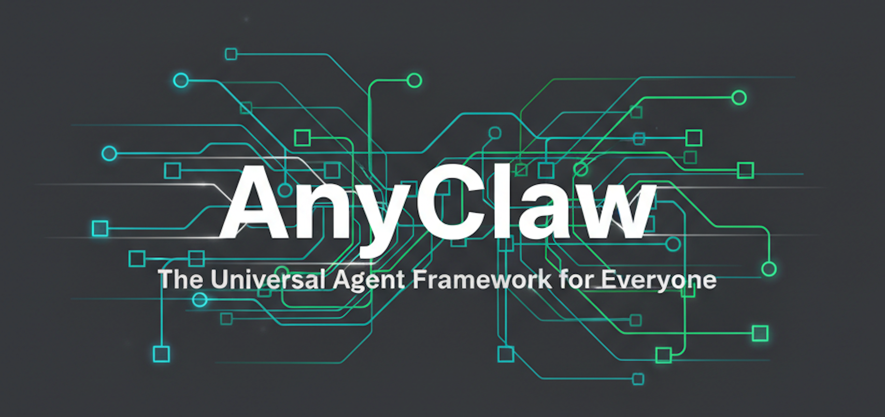

<div align="center">



# AnyClaw Agent框架

**轻量化 Agent 框架，快速搭建专属垂类Agent**

[](https://www.python.org/downloads/)
[](https://www.langchain.com/)
[](https://github.com/Textualize/rich)
[](https://typer.tiangolo.com/)
[](https://github.com/yourusername/anyclaw)

</div>

---

## 📖 项目介绍

**AnyClaw** 是一个**轻量化**的 Agent 框架，基于 LangChain 构建，采用 ReAct（Reasoning + Acting）模式，让你能够快速开发并接入 skills/tools，搭建属于自己的垂类Agent。

### 1. 核心特性

- **轻量化设计**：核心代码简洁高效，依赖少，部署方便，易于扩展
- **流式响应**：支持 token 级别的实时流式输出，提供流畅的交互体验
- **ReAct Agent**：基于 ReAct 模式的智能推理与执行框架
- **多模型支持**：支持 OpenAI、Gemini、Qwen、DeepSeek、Kimi 等多种 LLM 提供商
- **工具系统**：灵活的工具扩展机制，轻松添加自定义工具
- **Skills 元技能**：支持通过 `skills/*/SKILL.md` 注册元技能，提供标准化脚本入口（`/skills` 查看列表）
- **会话管理**：完整的会话持久化与恢复功能，支持多会话切换
- **Token 追踪**：实时追踪每次调用的 token 消耗，支持按步骤统计
- **消息压缩**：自动压缩历史消息，节省 token 成本
- **任务隔离**：每个会话拥有独立的 sandbox 目录，文件互不干扰
- **多模式支持**：提供 CLI 命令行、API 服务两种运行模式
- **美观界面**：基于 Rich 的美化命令行界面，支持 Markdown 渲染
- **命令系统**：丰富的命令支持（`/new`, `/memory`, `/models`, `/tools`, `/clear`, `/exit`）

### 2. 核心定位

核心设计理念是：**只需 vibe coding专属的工具，即可改造搭建为自己的通用/垂类Agent**。

- **轻量化**：框架设计简洁，核心功能模块化，易于理解和定制
- **低侵入**：所有配置都通过简单的 YAML 文件和代码修改即可完成，无需深入框架底层
- **高扩展性**：支持自定义工具和技能，快速扩展 Agent 能力
- **多模式**：提供命令行和 API 两种运行模式，满足不同场景需求

### 3. 运行模式

AnyClaw 提供两种运行模式，满足不同场景的需求：

#### （1）CLI 命令行模式
- **使用方式**：`anyclaw-cli` 或 `python -m cli.main`
- **特点**：交互式命令行界面，支持实时对话和工具调用
- **适用场景**：本地开发、调试、个人使用

#### （2）API 服务模式
- **使用方式**：`anyclaw-api`
- **特点**：后台挂载 HTTP 服务，提供 RESTful 接口
- **适用场景**：集成到其他应用、多用户访问、自动化流程

### 4. 亮点展示

- **快速上手**：简单的安装和配置流程，5分钟即可开始使用
- **灵活定制**：支持修改图标、欢迎语、system prompt 等，个性化你的 Agent
- **智能工具调用**：基于 ReAct 模式的智能推理，自动选择合适的工具执行任务
- **会话管理**：完整的会话持久化和恢复功能，支持多会话切换
- **token 优化**：自动追踪和压缩消息，节省 token 成本
- **多模型适配**：支持多种 LLM 提供商，根据不同场景选择合适的模型
- **标准化技能**：通过 SKILL.md 注册元技能，提供标准化的能力扩展机制

---

## 🎬 功能演示

### 1. 主页界面
*-- 美观的主界面，展示项目 Logo 和所有可用命令，支持快速开始新会话或恢复历史会话*


### 2. 新建会话
*-- 使用 `/new` 命令创建新会话，每个会话拥有独立的 task_id 和沙箱目录，实现任务隔离*


### 3. 工具调用
*-- Agent 智能调用工具执行任务，实时显示工具调用过程和结果，支持流式输出和 Token 追踪*


### 4. 会话恢复
*-- 使用 `/memory` 命令查看并恢复历史会话，支持多会话管理和无缝切换，保留完整的对话历史*


### 5. 工具列表
*-- 使用 `/tools` 命令查看所有已注册的工具，了解每个工具的功能描述和使用方式*


### 6. 模型列表
*-- 使用 `/models` 命令查看所有配置的模型信息，包括不同场景下的模型配置（main、text_generation 等）*


### 7. 清除记忆
*-- 使用 `/clear` 命令清除所有会话记忆和沙箱文件，需要确认操作，确保数据安全*


---

## 🚀 快速部署

### 1. 环境要求

- Python 3.10+
- pip 或 conda

### 2. 安装步骤

（1） **克隆项目**
```bash
git clone https://github.com/wz289494/anyclaw.git
cd anyclaw
```

（2） **创建虚拟环境（推荐）**
```bash
# 创建虚拟环境
# Windows
python -m venv venv

# Linux/Mac
python3 -m venv venv

# 激活虚拟环境
# Windows
venv\Scripts\activate

# Linux/Mac
source venv/bin/activate
```

（3） **安装依赖**
```bash
pip install -r requirements.txt
```

（3.1）**安装 Playwright 浏览器驱动（用于 skill_download 工具）**
```bash
playwright install chromium
```

（4） **配置环境变量**

创建 `.env` 文件，配置你的 API Key：

```env
# OpenAI
OPENAI_APIKEY=your_openai_api_key

# DeepSeek
DEEPSEEK_APIKEY=your_deepseek_api_key

# Qwen / DashScope
QWEN_APIKEY=your_qwen_api_key

# Gemini
GEMINI_APIKEY=your_gemini_api_key

# Kimi
KIMI_APIKEY=your_kimi_api_key
```

（5） **配置模型**

编辑 `config/model.yaml`，设置你使用的模型。配置文件支持多个场景，每个场景可以配置不同的模型：

```yaml
# 主流程模型：作为 ReAct Agent 的底座
main:
  provider: deepseek  # 或 openai, gemini, qwen, kimi
  model: deepseek-chat
  api_key_env: DEEPSEEK_APIKEY

# 文本生成模型：用于文本生成任务
text_generation:
  provider: qwen
  model: qwen-plus
  api_key_env: QWEN_APIKEY

# 元素提取模型：用于从文本中提取结构化信息
element_extraction:
  provider: qwen
  model: qwen-plus
  api_key_env: QWEN_APIKEY

# 代码生成模型：用于代码生成任务
code_generation:
  provider: deepseek
  model: deepseek-chat
  api_key_env: DEEPSEEK_APIKEY
```

**配置场景说明：**

- **main**：主流程模型，作为 ReAct Agent 的核心底座，负责推理和工具调用决策
- **text_generation**：文本生成模型，专门用于文本生成任务，如文章写作、内容创作等
- **element_extraction**：元素提取模型，用于从文本中提取结构化信息，如实体识别、信息抽取等
- **code_generation**：代码生成模型，专门用于代码生成任务，如代码补全、代码生成等

**支持的模型提供商：**

- **OpenAI**：OpenAI 官方 API，支持 GPT-4、GPT-3.5 等模型，稳定可靠，适合生产环境
- **Gemini**：Google 的 Gemini 系列模型，支持 gemini-pro、gemini-flash 等，性能强劲，多模态能力强
- **Qwen**：阿里云通义千问模型，支持 qwen-max、qwen-plus、qwen-turbo、qwen-coder 等，国内访问速度快，中文理解能力强
- **Kimi**：Moonshot AI 的 Kimi 模型，支持长上下文（200K tokens），适合处理长文本任务和复杂文档分析

（6） **安装项目**

安装项目到虚拟环境中（以开发模式安装，便于修改代码）：

```bash
pip install -e .
```

（7） **运行项目**
```bash
# 方式1：使用命令行入口（需要先执行 pip install -e .）
anyclaw-cli

# 方式2：直接运行（无需安装）
python -m cli.main
```

### API 模式（HTTP 服务）

```bash
anyclaw-api
```

默认监听 `0.0.0.0:7000`，提供以下接口（返回 Markdown 或 JSON）：

| 方法 | 路径 | 说明 |
|---|---|---|
| GET | /api/tools | 工具列表（markdown） |
| GET | /api/models | 模型列表（markdown） |
| GET | /api/skills | skills 列表（markdown） |
| POST | /api/new | 创建新任务，返回 task_id |
| GET | /api/memory | 返回 task_id 列表 |
| POST | /api/clear | 清理 memory 与 sandbox |
| POST | /api/agent | 运行 agent（流式返回工具调用与最终结果） |

`/api/agent` 请求示例：

```bash
curl -N -X POST http://localhost:7000/api/agent \
  -H "Content-Type: application/json" \
  -d '{"task_id":"<task_id>","query":"你好"}'
```

服务会返回 NDJSON（逐行 JSON），包含 `tool_call`、`tool_result` 与 `final` 事件。

---

## 💡 使用技巧

### 1. 基本命令

- `/new` - 开启新的会话
- `/memory` - 查看并恢复之前的会话（最多显示5个）
- `/models` - 查看所有模型配置
- `/tools` - 查看所有可用工具
- `/skills` - 查看所有可用 skills（扫描 `skills/*/SKILL.md`）
- `/clear` - 清除 memory 和 sandbox（需确认）
- `/exit` - 退出程序

### 2. 会话管理

- 每个会话都有唯一的 `task_id`，用于隔离数据和文件
- 会话数据保存在 `memory/STM/` 目录
- 任务文件保存在 `sandbox/{task_id}/` 目录
- 使用 `/memory` 命令可以快速恢复之前的会话

### 3. Token 追踪

- 系统会自动追踪每次调用的 token 消耗
- 支持按步骤统计（agent_processing, tool_xxx 等）
- Token 使用情况会实时显示在界面上
- 历史记录保存在会话数据中

### 4. 消息压缩

- 当上下文 token 数超过限制（默认 20000）时，会自动压缩历史消息
- 压缩后的消息会生成摘要，保留关键信息
- 压缩信息会在界面上提示

---

## 🔧 Vibe coding 继续开发

想要定制自己的 Agent？很简单，跟着下面的步骤来就行。

### 1. Vibe Coding Tools SOP

**步骤 1：让 AI 熟悉项目**

开始之前，先告诉你的 coding 工具（比如 Cursor、GitHub Copilot 等）：
```
-先熟悉当前项目，了解项目结构和核心模块
-重点关注 agent/reactagent.py、tools/ 目录、skills/ 目录的结构
-了解工具注册和技能加载的机制
```

**步骤 2：个性化定制**

```
-修改项目名称和 Logo：
  -将 logo 图片放到 docs/logo图/logo图.png，替换掉原来的
  -修改 cli/display.py 中的 print_welcome() 和 print_icon() 函数
  -更新 pyproject.toml 中的项目信息

-定制 System prompt：
  -编辑 prompt/system_prompt.txt 文件
  -设定角色、认知和性格
  -添加领域专业知识
```

**步骤 3：添加新工具**

```
-在 tools/ 目录下创建新的工具文件（如 my_tool.py）
-实现工具函数，使用 @tool 装饰器
-在 tools/__init__.py 中导出工具
-在 agent/reactagent.py 中注册工具到 AGENT_TOOLS 列表
-测试工具功能
```

**步骤 4：开发新技能**

```
-在 skills/ 目录下创建新的技能文件夹（如 my_skill）
-创建 SKILL.md 文件，定义技能元数据和使用说明
-在 scripts/ 目录下创建技能脚本
-确保脚本支持标准化的输入输出格式
```

### 2. Skills 载入 SOP

**步骤 1：创建技能目录结构**

```
skills/
└── my_skill/           # 技能名称
    ├── SKILL.md        # 技能元数据和说明
    └── scripts/        # 技能脚本
        └── my_skill.py # 技能实现
```

**步骤 2：编写 SKILL.md 文件**

```markdown
# My Skill

## 技能说明
- 描述：这是一个示例技能
- 功能：实现xxx功能
- 适用场景：xxx

## 脚本入口
- 脚本路径：scripts/my_skill.py
- 执行命令：python scripts/my_skill.py

## 参数说明
- input: 输入参数
- output: 输出结果
```

**步骤 3：实现技能脚本**

```python
# scripts/my_skill.py
import json

def main():
    # 实现技能逻辑
    result = {"status": "success", "data": "技能执行结果"}
    print(json.dumps(result, ensure_ascii=False))

if __name__ == "__main__":
    main()
```

**步骤 4：测试技能**

```bash
# 测试技能
python skills/my_skill/scripts/my_skill.py

# 在 AnyClaw 中使用
/skills  # 查看技能列表
# 然后让 Agent 使用该技能
```

### 3. Tool 与 Skills 的区别

| 特性 | Tool | Skills |
|------|------|--------|
| **定义方式** | Python 函数，使用 @tool 装饰器 | 目录结构 + SKILL.md + 脚本 |
| **注册方式** | 在 agent/reactagent.py 中显式注册 | 自动扫描 skills/ 目录 |
| **执行方式** | 直接调用 Python 函数 | 通过子进程执行脚本 |
| **返回格式** | JSON 字符串 | JSON 字符串 |
| **适用场景** | 核心功能、高频操作、需要访问框架内部状态 | 扩展功能、独立脚本、模块化能力 |
| **开发难度** | 中等（需要了解框架结构） | 低（独立脚本，无需了解框架） |
| **示例** | file_manager, cli_runner | pdf, xlsx, baidu-search |

### 4. 模型选择指南

#### 主模型 vs 简单模型

| 特性 | 主模型（如 GPT-4, Gemini Pro） | 简单模型（如 GPT-3.5, Gemini Flash） |
|------|-------------------------------|-----------------------------------|
| **流式响应** | 支持，响应速度快 | 支持，但可能不如主模型稳定 |
| **工具调用能力** | 强，能准确理解和使用工具 | 较弱，可能需要更多提示 |
| **推理能力** | 强，适合复杂任务 | 较弱，适合简单任务 |
| **上下文长度** | 长（如 128K+ tokens） | 短（如 4K-16K tokens） |
| **成本** | 较高 | 较低 |
| **适用场景** | 复杂推理、多步骤任务、需要工具调用的场景 | 简单问答、文本生成、快速响应的场景 |

#### 模型选择建议

1. **主流程模型（main）**：选择具有强推理能力和工具调用能力的模型，如 GPT-4、Gemini Pro、Qwen Plus 等

2. **文本生成模型（text_generation）**：选择擅长文本创作的模型，如 GPT-3.5、Qwen Turbo 等

3. **元素提取模型（element_extraction）**：选择擅长结构化信息提取的模型，如 GPT-4、Kimi 等

4. **代码生成模型（code_generation）**：选择擅长代码生成的模型，如 DeepSeek、GPT-4、Qwen Coder 等

### 5. 更换 Logo 和欢迎语

**换 Logo**：
```
-将 logo 图片放到 docs/logo图/logo图.png，替换掉原来的就行
```

**改欢迎语**：
```
-我现在需要更换项目名称为：
-修改 cli/display.py 中的 print_welcome() 函数，更换欢迎语
-修改 cli/display.py 中的 print_icon() 函数，更换 CLI 图标和 ASCII 艺术字
-修改项目中其他所有涉及 anyclaw 或 AnyClaw 的位置，更改为项目名称
```

**需要更换的文件和位置**：

1. **`pyproject.toml`**：
   - `name = "anyclaw"` → `name = "YOUR_PROJECT_NAME"`
   - `description = "anyclaw：agent框架"` → `description = "YOUR_PROJECT_NAME：agent框架"`
   - `anyclaw = "cli.main:main"` → `YOUR_COMMAND_NAME = "cli.main:main"`

2. **`cli/display.py`**：
   - `print_icon()` 函数中的 ASCII 艺术字和注释（替换 "ANYCLAW" 为 "YOUR_PROJECT_NAME"）
   - `print_welcome()` 函数中的欢迎语：`"欢迎使用 AnyClaw - Agent智能助手"` → `"欢迎使用 YOUR_PROJECT_NAME - Agent智能助手"`

3. **`cli/main.py`**：
   - 所有 `"AnyClaw"` 的显示文本 → `"YOUR_PROJECT_NAME"`

4. **`cli/interactive.py`**：
   - 所有 `"AnyClaw"` 的显示文本 → `"YOUR_PROJECT_NAME"`

5. **`utils/path.py`**：
   - 注释中的 `"anyclaw 项目所在目录"` → `"YOUR_PROJECT_NAME 项目所在目录"`

6. **`README.md`**：
   - 项目标题、描述、所有提到 AnyClaw 的地方 → `YOUR_PROJECT_NAME`
   - GitHub 链接中的用户名和仓库名 → `YOUR_GITHUB_USERNAME/YOUR_REPO_NAME`

### 6. 定制 System prompt

想让你的 Agent 更专业？更幽默？更严谨？直接改 system prompt 就行
```
-为我修改prompt system：
-设定角色：（如舆情分析助手）
-设定认知：具备React理解 + 专属理解（如舆情分析的方法）
-设定名称或性格：（如平和、热情）
```
### 7. 给 Agent 添加新能力（工具）

想让 Agent 能做更多事情？给它加工具就行

**第一步：创建工具文件**

首先，需要在 `tools/` 目录下创建一个新的 Python 文件

```
-在 tools/ 目录下新建一个文件，命名为 （my_tool.py）
工具用途说明：
工具时机说明：
工具逻辑：
工具输入参数：
工具输出参数：
-工具函数需要用 @tool 装饰器，返回值必须是 JSON 字符串格式
-输出参数字段需要包含至少其一（如 result、data、output 等）
-如果需要保存文件，必须使用任务ID作为路径，参考demo工具的文件保存处理
-工具内部需要调用 LLM 来分析数据或生成内容，可以根据场景选择合适的模型使用：如使用项目中的（text_generation、element_extraction、code_generation）
```

**第二步：导出工具**

创建好工具文件后，需要在 `tools/__init__.py` 中导出它

```
打开 tools/__init__.py，把新的工具导入并加到 __all__ 列表里
```

代码示例：

```python
from tools.my_tool import my_tool

__all__ = ["my_tool"]
```

**第三步：注册到 Agent**

最后一步，把工具注册到 Agent 的工具列表中。这样 Agent 才能知道有这个工具可以使用。

```
打开 agent/reactagent.py，找到 AGENT_TOOLS 这一行，把新的工具导入并加到列表里
```

代码示例：

```python
from tools import my_tool

# 当前注册的工具列表
AGENT_TOOLS = [my_tool]
```

**第四步：测试工具**

工具添加完成后，写一个测试文件，直接运行查看效果

```
在scripts中新增一个工具测试文件，用于测试新的工具（如my_tool）
格式按照run_demo示例一致
```

---

## 📁 项目架构

### 1. 技术栈

- **LangChain 1.0** - Agent 框架、工具系统、流式输出
- **Rich** - CLI 美化与 Markdown 渲染
- **Typer** - CLI 框架
- **PyYAML** - 配置管理
- **Python 3.10+** - 核心语言

### 2. 目录树

```
anyclaw/
├── agent/              # Agent 核心逻辑
│   ├── __init__.py
│   └── reactagent.py  # ReAct Agent 实现
├── cli/                # 命令行界面
│   ├── __init__.py
│   ├── main.py        # 主入口
│   ├── interactive.py # 交互式运行
│   ├── display.py     # 显示工具（Rich UI）
│   ├── session_ui.py  # 会话管理 UI
│   ├── tools_ui.py    # 工具列表 UI
│   ├── models_ui.py   # 模型列表 UI
│   └── clear_utils.py # 清除工具
├── config/             # 配置文件
│   ├── __init__.py
│   ├── model.yaml     # 模型配置
│   └── prompt.yaml    # Prompt 配置
├── docs/               # 文档和图片
│   ├── logo图/        # Logo 图片
│   └── 效果图/        # 功能演示图
├── memory/             # 会话存储
│   └── STM/           # 短期记忆（会话数据）
├── model/              # 模型工厂
│   ├── __init__.py
│   └── factory.py     # 模型实例化
├── prompt/             # Prompt 模板
│   └── system_prompt.txt
├── sandbox/            # 任务运行目录
├── tools/              # 工具定义
│   ├── __init__.py
│   └── xxx.py  # 示例工具
├── utils/              # 工具函数
│   ├── __init__.py
│   ├── session_manager.py  # 会话管理
│   ├── token_tracker.py    # Token 追踪
│   ├── env_loader.py        # 环境变量加载
│   ├── message_utils.py     # 消息工具（压缩、转换等）
│   ├── path.py              # 路径工具
│   ├── prompt_loader.py     # Prompt 加载
│   └── task_context.py      # 任务上下文管理
├── scripts/            # 脚本文件
│   └── run_xxx.py  # 工具测试脚本
├── pyproject.toml      # 项目配置
├── requirements.txt    # 依赖列表
├── LICENSE.txt         # 许可证
└── README.md           # 项目说明
```

---

## 📝 许可证

本项目采用 **NON-COMMERCIAL LEARNING LICENSE 1.1**（非商业学习许可证）。

### 许可证说明

Copyright (c) 2024 relakkes@gmail.com

本软件及其相关文档文件（以下简称"软件"）在以下条件下授权使用：

#### 授权范围

版权所有者授予任何接受本许可证的自然人或法人实体（以下简称"用户"）免费、非独占、不可转让的权利，以非商业学习为目的使用、复制、修改和合并本软件。

#### 使用条件

1. 用户必须在软件及其副本的所有合理显著位置包含上述版权声明和本许可证声明
2. 软件仅限于学习和研究目的，不得用于大规模爬取或干扰平台运营的活动
3. 未经版权所有者书面同意，软件不得用于任何商业目的或对第三方造成不当影响

#### 免责声明

1. 软件按"现状"提供，不提供任何明示或暗示的保证，包括但不限于适销性、特定用途适用性和非侵权性的保证
2. 在任何情况下，版权所有者均不对因使用或无法使用本软件而产生的任何直接、间接、偶然、特殊、示范性或后果性损害承担责任

#### 完整许可证

完整的许可证文本请查看 [LICENSE.txt](LICENSE.txt) 文件。

**注意**：如需商业使用，请联系版权所有者获取商业许可。

---

## 🤝 贡献

欢迎提交 Issue 和 Pull Request！

---

## ⭐ Star History

如果这个项目对你有帮助，请给个 Star ⭐

---

<div align="center">

**Made with ❤️ by AnyClaw Team**

</div>
